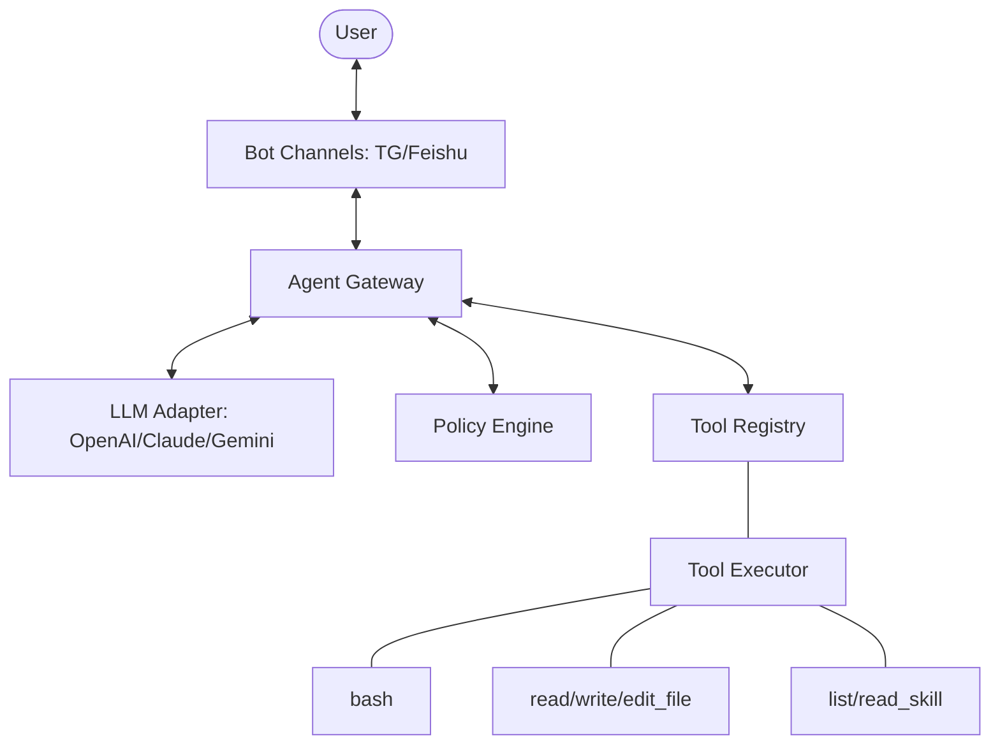

# OpenVia

[English](./README.md) | [中文](./README_CN.md)

Universal, Extensible CLI Gateway for AI Agents.

## Overview

OpenVia is a bridge between AI Large Language Models and communication platforms
(Telegram, Feishu, etc.). It provides a unified gateway that allows you to
interact with AI agents through mobile or web interfaces securely.

## Features

- **Multi-LLM Native Support**: Works with OpenAI, Claude, Gemini native API
  formats without heavy SDK dependencies. **Full multimodal support**
  (images/text).
- **Micro-kernel Architecture**: Headless, low-resource agent core with clear
  separation of proposal and execution.
- **Multi-Channel**: Supports Telegram, Feishu (Lark) with **image/photo**
  support.
- **Policy Engine**: Granular permission control (allow, deny, require_approval)
  for all tool calls.
- **Built-in Tools**: File operations, shell execution, and specialized skill
  management.
- **Skills System**: User-defined knowledge extensions with `eager` or `lazy`
  loading strategies.
- **Session Isolation**: Independent conversation history and context for
  multiple users.
- **Powered by Bun**: Built on ultra-fast Bun runtime (v1.2+).

---



---

## Prerequisites

- **Bun**: v1.2.0 or higher (for running from source)
- **Node.js**: v18+ (optional, for npm installation)

## Installation

### Option A: Install via npm

```bash
npm install -g @lrbmike/openvia
# or
bun install -g @lrbmike/openvia
```

### Option B: Download Pre-built Binary

Download from [Releases](https://github.com/lrbmike/OpenVia/releases):

- `openvia-linux` - Linux x64
- `openvia.exe` - Windows x64
- `openvia-darwin` - macOS x64
- `openvia-darwin-arm64` - macOS Apple Silicon

### Option C: Install from Source

```bash
git clone https://github.com/lrbmike/OpenVia.git
cd OpenVia
bun install
bun link
```

---

## Quick Start

### 1. Initialize Configuration

```bash
openvia init
```

This creates `~/.openvia/config.json`.

### 2. Configure LLM and Channel

Edit `~/.openvia/config.json`:

```json
{
  "adapters": {
    "default": "telegram",
    "telegram": {
      "botToken": "your-telegram-bot-token",
      "allowedUserIds": [123456789]
    },
    "feishu": {
      "appId": "your-app-id",
      "appSecret": "your-app-secret"
    }
  },
  "llm": {
    "format": "openai",
    "apiKey": "sk-xxx",
    "baseUrl": "https://api.openai.com/v1",
    "model": "gpt-4o",
    "systemPrompt": "You are a helpful assistant. Running on Windows, use PowerShell commands.",
    "timeout": 120000,
    "maxTokens": 4096,
    "maxIterations": 10,
    "shellConfirmList": ["rm", "mv", "sudo", "del", "rmdir"]
  },
  "logging": {
    "level": "info"
  }
}
```

### 3. Run the Gateway

```bash
openvia
```

---

## Configuration

### LLM Configuration

| Field              | Description                                                                                                                     |
| ------------------ | ------------------------------------------------------------------------------------------------------------------------------- |
| `format`           | API format: `openai`, `claude`, or `gemini`                                                                                     |
| `apiKey`           | Your API key                                                                                                                    |
| `baseUrl`          | API endpoint. If it ends with `/chat/completions` or `/responses`, it's used as-is. Otherwise, `/chat/completions` is appended. |
| `model`            | Model name (e.g., `gpt-4o`, `qwen-max`)                                                                                         |
| `systemPrompt`     | System prompt for all conversations                                                                                             |
| `maxIterations`    | Max tool call rounds per message (default: 10)                                                                                  |
| `shellConfirmList` | Commands requiring user confirmation                                                                                            |
| `skillLoading`     | `lazy` (on-demand) or `eager` (preload) skills strategy (default: `eager`)                                                      |

| Provider | Format   | Example baseUrl                                     |
| -------- | -------- | --------------------------------------------------- |
| OpenAI   | `openai` | `https://api.openai.com/v1`                         |
| Claude   | `claude` | `https://api.anthropic.com`                         |
| Gemini   | `gemini` | `https://generativelanguage.googleapis.com`         |
| Qwen     | `openai` | `https://dashscope.aliyuncs.com/compatible-mode/v1` |
| DeepSeek | `openai` | `https://api.deepseek.com/v1`                       |
| Ollama   | `openai` | `http://localhost:11434/v1`                         |

---

## Skills System

Skills are user-defined knowledge extensions stored in `~/.openvia/skills/`.

### Skill Structure

```
~/.openvia/skills/
└── my-skill/
    ├── SKILL.md      # Required: Instructions in Markdown
    └── scripts/      # Optional: Helper scripts
```

### Example Skill

`~/.openvia/skills/current-time/SKILL.md`:

````markdown
---
name: Current Time Expert
description: Get current time in various formats
---

# Get Current Time

Use PowerShell to get current time:

```powershell
powershell -Command "Get-Date -Format 'yyyy-MM-dd HH:mm:ss'"
```
````

````
The AI will automatically use `read_skill` to load this knowledge when relevant.

---

## Built-in Tools

| Tool | Description |
|------|-------------|
| `bash` | Execute shell commands |
| `read_file` | Read file contents |
| `write_file` | Write content to file |
| `edit_file` | Edit file by replacing content |
| `list_skills` | List available user skills |
| `read_skill` | Read skill instructions |

---

## Development

```bash
# Dev mode (hot reload)
bun run dev

# Build
bun run build

# Build for all platforms
bun run build:all
````

---

## License

MIT

## Roadmap

1. **Multi-Channel Concurrent**: Support simultaneous listening on multiple
   platforms.
2. **Web Dashboard**: Visual configuration and session management.
3. **More LLM Formats**: Native Claude and Gemini format support.
