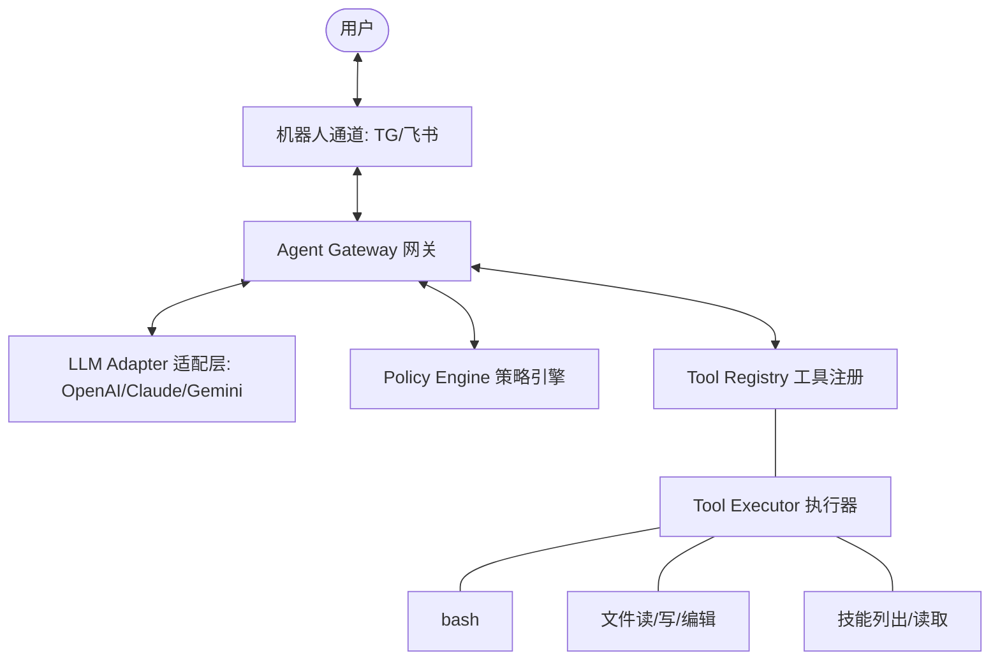

# OpenVia 中文指南

[English](./README.md) | [中文](./README_CN.md)

通用且可扩展的 AI Agent 命令行网关。

## 项目简介

OpenVia 是连接 AI
大语言模型与通信平台（Telegram、飞书等）的桥梁。它提供统一的网关，让你能够通过移动端或
Web 界面安全地与 AI 进行交互。

## 核心功能

- **原生多模型支持**: 原生适配 OpenAI、Claude、Gemini API 格式，无需重型
  SDK。对于支持多模态的模型，已开启完整的**图片/文本混合输入**支持。
- **微内核架构**: Headless 设计，执行权与决策权分离，资源占用低。
- **多渠道接入**: 支持 Telegram、飞书（Lark），可扩展的渠道架构。
- **策略引擎**: 对所有工具调用进行粒度化的权限控制（允许、拒绝、需确认）。
- **内置工具**: 完善的文件操作、Shell 执行以及专门的技能管理工具。
- **Skills 系统**: 用户自定义知识扩展，支持 `eager` (预加载) 或 `lazy`
  (按需读取) 策略。
- **会话隔离**: 为多用户提供完全独立的对话历史与执行环境。
- **Bun 驱动**: 基于超高性能的 Bun 运行时（推荐 v1.2+）。

---



---

## 环境准备

- **Bun**: v1.2.0 或更高版本（从源码运行）
- **Node.js**: v18+（可选，用于 npm 安装）

## 安装说明

### 方式 1：通过 npm 安装

```bash
npm install -g @lrbmike/openvia
# 或者
bun install -g @lrbmike/openvia
```

### 方式 2：下载预编译二进制文件

从 [Releases](https://github.com/lrbmike/OpenVia/releases) 下载：

- `openvia-linux` - Linux x64
- `openvia.exe` - Windows x64
- `openvia-darwin` - macOS x64
- `openvia-darwin-arm64` - macOS Apple Silicon

### 方式 3：从源码安装

```bash
git clone https://github.com/lrbmike/OpenVia.git
cd OpenVia
bun install
bun link
```

---

## 快速开始

### 1. 初始化配置

```bash
openvia init
```

这将创建 `~/.openvia/config.json`。

### 2. 配置 LLM 和渠道

编辑 `~/.openvia/config.json`：

```json
{
  "adapters": {
    "default": "telegram",
    "telegram": {
      "botToken": "your-telegram-bot-token",
      "allowedUserIds": [123456789]
    },
    "feishu": {
      "appId": "your-app-id",
      "appSecret": "your-app-secret",
      "allowedUserIds": ["ou_xxx", "ou_yyy"]
    }
  },
  "llm": {
    "format": "openai",
    "apiKey": "sk-xxx",
    "baseUrl": "https://api.openai.com/v1",
    "model": "gpt-4o",
    "systemPrompt": "你是一个有用的助手。运行在 Windows 系统上，请使用 PowerShell 命令。",
    "timeout": 120000,
    "maxTokens": 4096,
    "maxIterations": 10,
    "shellConfirmList": ["rm", "mv", "sudo", "del", "rmdir"]
  },
  "logging": {
    "level": "info"
  }
}
```

### 3. 运行网关

```bash
openvia
```

---

## 配置说明

### LLM 配置

| 字段               | 说明                                                                                                    |
| ------------------ | ------------------------------------------------------------------------------------------------------- |
| `format`           | API 格式: `openai`、`claude` 或 `gemini`                                                                |
| `apiKey`           | 你的 API 密钥                                                                                           |
| `baseUrl`          | API 端点。若以 `/chat/completions` 或 `/responses` 结尾，则直接使用；否则自动拼接 `/chat/completions`。 |
| `model`            | 模型名称（如 `gpt-4o`、`qwen-max`）                                                                     |
| `systemPrompt`     | 所有对话的系统提示词                                                                                    |
| `maxIterations`    | 每条消息最大工具调用轮次（默认: 10）                                                                    |
| `shellConfirmList` | 需要用户确认的命令列表                                                                                  |
| `skillLoading`     | `lazy` (按需加载) 或 `eager` (预加载) 技能策略 (默认: `eager`)                                          |

| 提供商          | 格式     | baseUrl 示例                                        |
| --------------- | -------- | --------------------------------------------------- |
| OpenAI          | `openai` | `https://api.openai.com/v1`                         |
| Claude          | `claude` | `https://api.anthropic.com`                         |
| Gemini          | `gemini` | `https://generativelanguage.googleapis.com`         |
| Qwen (通义千问) | `openai` | `https://dashscope.aliyuncs.com/compatible-mode/v1` |
| DeepSeek        | `openai` | `https://api.deepseek.com/v1`                       |
| Ollama (本地)   | `openai` | `http://localhost:11434/v1`                         |

---

## Skills 系统

Skills 是用户自定义的知识扩展，存放于 `~/.openvia/skills/`。

### Skill 结构

```
~/.openvia/skills/
└── my-skill/
    ├── SKILL.md      # 必需：Markdown 格式的指令
    └── scripts/      # 可选：辅助脚本
```

### 示例 Skill

`~/.openvia/skills/current-time/SKILL.md`：

````markdown
---
name: 时间专家
description: 获取各种格式的当前时间
---

# 获取当前时间

使用 PowerShell 获取当前时间：

```powershell
powershell -Command "Get-Date -Format 'yyyy-MM-dd HH:mm:ss'"
```
````

````
AI 会在相关时自动使用 `read_skill` 加载这些知识。

---

## 内置工具

| 工具 | 说明 |
|------|------|
| `bash` | 执行 Shell 命令 |
| `read_file` | 读取文件内容 |
| `write_file` | 写入文件内容 |
| `edit_file` | 编辑文件（替换内容） |
| `list_skills` | 列出可用的用户 Skills |
| `read_skill` | 读取 Skill 指令 |

---

## 开发

```bash
# 开发模式（热重载）
bun run dev

# 构建
bun run build

# 构建所有平台
bun run build:all
````

---

## 开源协议

MIT

## 未来规划

1. **多渠道并发**: 支持同时监听多个平台。
2. **Web 管理界面**: 可视化配置和会话管理。
3. **更多 LLM 格式**: 原生 Claude 和 Gemini 格式支持。
